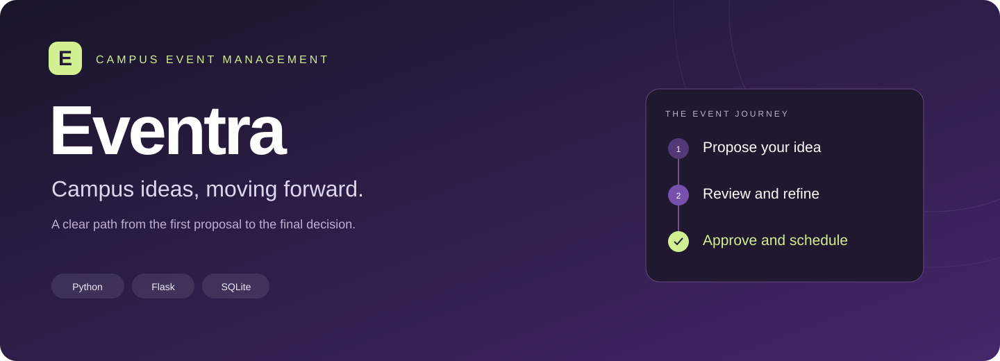
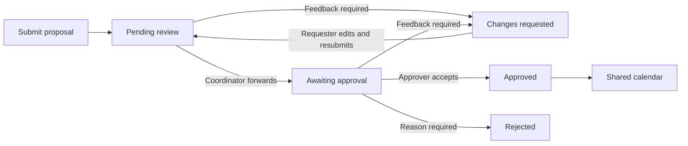
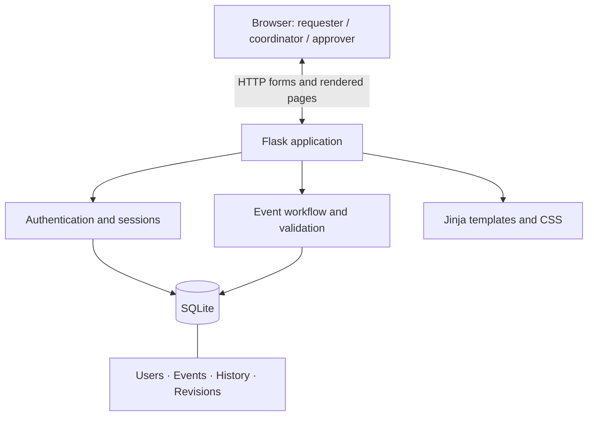

<p align="center">
  
</p>

<h1 align="center">Eventra</h1>
<p align="center"><strong>Campus Event Management System</strong></p>
<p align="center">Proposals, reviews, revisions, and approvals — connected in one workspace.</p>
<p align="center"><strong>Python · Flask · SQLite · Jinja · CSS</strong></p>
<p align="center">
  <a href="#why-eventra">About</a> ·
  <a href="#what-each-role-can-do">Features</a> ·
  <a href="#the-approval-workflow">Workflow</a> ·
  <a href="#run-it-locally">Get started</a> ·
  <a href="#testing-and-review">Testing</a>
</p>

---

## Why Eventra?

A campus event starts with an idea. Turning that idea into an approved booking requires a proposal, feedback, scheduling checks, and a clear decision.

**Eventra brings those steps together.** Student clubs and faculty members submit proposals and track progress. Coordinators review the details, and designated approvers make final decisions. Approved events appear on a shared college calendar.

This is an independent educational project. It is not officially affiliated with a university.

## What each role can do

| Requester — clubs & faculty | Event coordinator | Approver |
| :--- | :--- | :--- |
| Submit an event proposal | Review pending proposals | Review forwarded proposals |
| Track personal requests | Request changes with feedback | Approve, return, or reject |
| Edit pending or returned requests | Forward proposals for approval | Check booking availability |
| Read decision history | Use a role-specific action queue | Record the final decision |

### Across the workspace

- **Searchable requests:** find proposals by title, organizer, or venue, with status filters.
- **Revision workflow:** returned proposals go back through coordinator review after resubmission.
- **Proposal archive:** inspect the details preserved across submitted versions.
- **Decision timeline:** see who acted, what they decided, and any feedback.
- **Room conflict checks:** prevent overlapping approved bookings at the same venue.
- **Shared calendar:** browse approved event summaries by month.
- **Role-based access:** requesters can access their own private proposal details; staff review the shared queue.

## The approval workflow



Pending and returned proposals can be edited by their owner. Reviewed, approved, and rejected proposals cannot. Rejection is terminal in this version.

## Engineering details that matter

### An approval must match the proposal reviewed

A reviewer may open a request while its owner is editing it. Eventra checks a version token inside the update transaction. If the proposal changed, the stale form receives **HTTP 409**, and the reviewer must refresh before acting. The same check prevents an old edit form from overwriting newer work.

### A room can only be reserved once

Final approval checks venue, date, and overlapping times within a serialized SQLite transaction. Two concurrent approvals cannot both reserve the same room for overlapping times. Back-to-back events are allowed. Unapproved proposals do not reserve rooms.

### Decisions and proposal details have separate histories

The decision timeline records workflow actions. The proposal archive preserves submitted field values at creation and around edits. Workflow actions also advance the version token, so archive version numbers can have gaps.

## Architecture



Eventra uses server-rendered pages. The Python backend handles validation, authorization, and persistence; Jinja and CSS deliver the interface.

| Layer | Technologies / responsibility |
| :--- | :--- |
| Interface | HTML, Jinja templates, responsive CSS |
| Application | Python, Flask blueprints, application factory |
| Authentication | Werkzeug password hashing, Flask sessions |
| Request protection | Flask-WTF CSRF, server-side validation, security headers |
| Persistence | SQLite, foreign keys, parameterized SQL, transactions |
| Verification | pytest with HTTP-level workflow tests |
| Serving | Flask locally; Waitress available for deployment |

## Database

| Table | Purpose |
| :--- | :--- |
| `users` | Identity, password hash, and assigned role |
| `events` | Proposal details, ownership, status, and version token |
| `history` | Actor, decision, feedback, and timestamp |
| `revisions` | Archived proposal fields and version |

Scheduling uses **Riyadh time (UTC+3)**. Events start and end on the same day. Audit timestamps use **UTC**.

## Run it locally

### 1. Get the project

Install Python 3.12 and Git, then open a terminal:

```bash
git clone https://github.com/wasmiarashid-cloud/Eventra.git
cd Eventra
```

You can also choose **Code → Download ZIP** on GitHub and extract it.

### 2. Create an environment and install dependencies

**Windows PowerShell**

```powershell
py -m venv .venv
.\.venv\Scripts\python.exe -m pip install -r requirements-dev.txt
Copy-Item .env.example .env
.\.venv\Scripts\python.exe -c "import secrets; print(secrets.token_hex(32))"
```

**macOS / Linux**

```bash
python3 -m venv .venv
.venv/bin/python -m pip install -r requirements-dev.txt
cp .env.example .env
.venv/bin/python -c "import secrets; print(secrets.token_hex(32))"
```

Open `.env` and replace the `SECRET_KEY` placeholder with the generated value. Keep `COOKIE_SECURE=0` for local HTTP. Never commit your real `.env` file.

### 3. Initialize and start

**Windows PowerShell**

```powershell
.\.venv\Scripts\python.exe -m flask --app eventra init-db
.\.venv\Scripts\python.exe -m flask --app eventra seed-demo
.\.venv\Scripts\python.exe -m flask --app eventra run
```

**macOS / Linux**

```bash
.venv/bin/python -m flask --app eventra init-db
.venv/bin/python -m flask --app eventra seed-demo
.venv/bin/python -m flask --app eventra run
```

Open **http://127.0.0.1:5000**. The seed command asks you to choose a password between 12 and 128 characters and only works with an empty database.

## Try the complete journey

| Demo account | Role |
| :--- | :--- |
| `requester@example.com` | Submit and revise proposals |
| `coordinator@example.com` | Review and forward proposals |
| `approver@example.com` | Make final decisions |

Use the password you chose during seeding for all three accounts. No working password is published in this repository.

1. Sign in as the requester and submit a future event.
2. Sign out, then sign in as the coordinator and request changes with feedback.
3. Return as the requester, edit the proposal, and resubmit it.
4. As the coordinator, forward the revised proposal.
5. As the approver, approve the event.
6. Open the calendar for the event's month and inspect its decision timeline.

To create individual accounts, run `python -m flask --app eventra create-user` using your virtual environment's Python. Public registration always creates requester accounts; staff roles are assigned through this administrative command.

## Testing and review

```powershell
# Windows
.\.venv\Scripts\python.exe -m pytest -q
```

```bash
# macOS / Linux
.venv/bin/python -m pytest -q
```

The suite contains **26 test cases**, covering:

- Authentication, role escalation, and ownership boundaries
- CSRF protection and HTML escaping
- Event input validation and revision transitions
- Required feedback and terminal rejection
- Overlapping bookings, back-to-back events, and concurrent approvals
- Stale decisions, stale edits, and proposal archives
- Calendar privacy, search scope, and calendar boundaries
- Persistence and non-destructive legacy database upgrades

The 26 cases passed across the recorded local test runs. This is functional regression evidence, not a penetration test or a load certification. A complete visual, mobile, and accessibility walkthrough is still pending.

## AI-assisted development

OpenAI Codex assisted with code review, workflow hardening, regression tests, and documentation. The changes include stale-form protection, proposal archives, and role-specific queues. Verification limits are documented above; AI-assisted review does not establish production readiness.

## Project structure

```text
Eventra/
├── docs/
│   └── banner.svg           # Repository identity
├── eventra/
│   ├── __init__.py          # Application factory and security headers
│   ├── auth.py              # Authentication and registration
│   ├── db.py                # Connections and administrative commands
│   ├── events.py            # Validation, workflow, search, and calendar
│   ├── schema.sql           # Tables and indexes
│   ├── static/              # Stylesheet and favicon
│   └── templates/           # Pages for each user journey
├── tests/
│   └── test_workflow.py     # Workflow and permission regression tests
├── .env.example
├── .gitignore
├── requirements.txt
├── requirements-dev.txt
└── README.md
```

## Upgrading an existing database

Back up `instance/`, then run `init-db` once with the updated code. The command preserves records, adds the version column if missing, and creates the archive table. Repeating it is safe. Earlier proposal edits cannot be reconstructed; the current details are captured when the proposal is next edited.

## Scope and next steps

This version uses a shared coordinator queue and a shared approver queue. Venue capacity rules, department-specific routing, notifications, attachments, approved-event cancellation, and external calendar integrations are future work.

Before public deployment, add login throttling, account recovery, verified campus membership or SSO, monitoring, and backups. Serve with Waitress behind an HTTPS reverse proxy and set `COOKIE_SECURE=1` with a strong secret key. See the documented verification limits before using real campus data.

---

<p align="center"><strong>Campus ideas, moving forward.</strong><br>Built to make the next step clear.</p>
